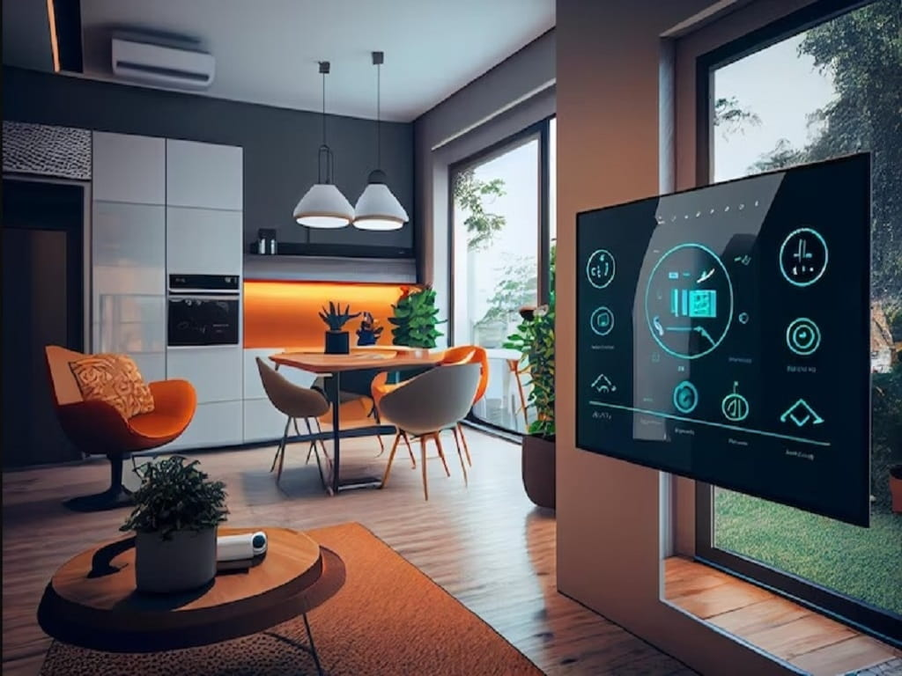

<h1 align="center">Smart Home</h1>


<p align="center">
  
</p>

---
## 🚀 Introduction

### Overview

This is a simple smart home system, done using **FreeRTOS** and **Atmega32** microcontroller.

*The system consists of the following functions:*

1. Gas Sensor to sense the gas level in the house.
2. Temperature Sensor to sense the temperature in the house.
3. Keypad to enter the password to open the door.
4. Motor to open/close the door when the password is correct.
5. Buzzer to alert the user when the system is in alarm mode:
   1. The password is incorrect for 3 times.
   2. The gas level is above the critical level.
6. LCD to display the system's data (temperature, door status, gas level).

> **Note:** This project can be fully tested, run, and developed using Proteus simulation software. **There is no need for physical hardware setup to get started**. **Proteus** provides a virtual testing environment that allows for the complete simulation of the microwave oven control system, including all electronic components and microcontroller interactions.

> The project is **open source** and you can use it for your own projects.


 
## 📑 Table of Contents

- [🚀 Introduction](#-introduction)
- [📑 Table of Contents](#table-of-contents)
- [⚙ Working](#-working)
    - [System Behavior](#system-behavior)
- [🗂  Project Hierarchy](#project-hierarchy)
    - [Directories](#directories)
    - [Files](#files)
- [🛠️ Development Tools Required](#️-development-tools-required)
- [⏬ Installation](#-Installation)
    - [Code](#code)
    - [Simulation](#simulation)
- [⏭ What is next?](#-what-is-next)
- [🙋‍♂️ Contribute](#️-contribute)
- [📞 Contact me](#-contact-me)

---

## ⚙ Working

### System Behavior


> **Simulation Video:** This is a simulation [video](docs/simulation/) using proteus that shows all system operations.

The System has 5 tasks. These are:

1. Getting Password: This is done using the task (```taskGetPassword(void *pv )```).
   The password is entered by the user using the keypad. The user has 3 attempts to enter the password. If the password is incorrect, the system will be in alarm mode.
   If the password is correct, the system will be in normal mode and the door will be opened.
2. Reading Sensors (Gas & Temperature): This is done using the task (```taskReadSensors(void *pv )```).
   It reads the gas level and temperature from the sensors. The gas level is measured by a potentiometer and the temperature is measured by the temperature sensor LM35.
   This task runs in Non-Blocking mode, which means that it will not block the main task. This is because it uses the ADC in the Non-Blocking mode (```ADC_SetNotification(void)```).
   The ```ADC_SetNotification(void)``` is called by the ADC ISR, and it only gives the semaphore to the taskReadSensors() to read the ADC registers.

   ```taskReadSensors(void *pv )```: will wait for the semaphore to be given by the ADC ISR.

   This task reads one sensor at a time, and when it reads the sensor, it will update the value of the specific sensor, then swap to the next sensor, and repeat this process.
3. Control Gas Level: This is done using the task (```taskControlGasLevel(void *pv )```).
   This task is responsible for controlling the gas level. It checks if the gas level is above the threshold and if it is:

   * Above: Open the window, and raise the flag to alert the user (buzzer).
   * Below: Close the window, and downs the flag of the alert.

   The gas level is read from the ADC using a potentiometer. It is converted to a percentage of the full scale.
4. Control Temperature: This is done using the task (```taskControlTemperature(void *pv )```).
   This task is responsible for controlling the temperature. It checks if the temperature is above the threshold and if it is:

   * Above: Open the fan.
   * Below: Stop the fan.

    Temperature is measured using the LM35 sensor. The LM35 sensor is connected to the ADC. The sensor gives 10mV for every degree Celsius. So, you can measure the temperature in degrees Celsius by dividing the ADC voltage value by 10mV.
5. Display System State On the LCD: This is done using the task (```taskDisplaySystemState(void *pv )```).
   This task is responsible for displaying the system's data. It displays:

   * The temperature.
   * The door status.
   * The fire alarm status.
   * The door security status.
---

## 🗂 Project Hierarchy

The project contains some files and directories:

### Directories

* **[Microchip-Studio-Project](Microchip-Studio-Project/)**: Contains the code implemented using Microchip Studio IDE.
* **[code](code/)**: Contains only the layred architecture code files.
* **[docs](docs/)**: Contains the documentation files and simulation pictures/videos.
* **[simulation](simulation/)**: Contains the simulation files (Proteus 8.7).

### Files

* **[README.md](README.md)**: The description of the project (What you are reading now).
* **[tools.md](tools.md)**: Contains **How to setup** the tools required to run this project.
* **[Doxyfile](Doxyfile)**: The configuration of doxygen application (Documentation generator).
* **[doxygen.mk](doxygen.mk)**: Contains the configuration and rules to be run using make to generate documents.


---

## 🛠️ Development Tools Required

Read this [guide]() to know what tools are required to develop this project.

---
## ⏬ Installation

### Clone

   Clone this repository to your local machine:
   ```
   git clone https://github.com/abd-elarhman/Microwave-Oven.git
   ```
### Code

**To develop the project, you need to:**

* YOU MUST HAVE **Microchip studio** installed on your computer.
* Open the **(Microchip-Studio-Project\Atmega32)** directory.
* Open the **[SmartHome.atsln]** file and it will open with Microchip Studio.
* You can build the project by clicking on **F7** key on keyboard.

**NOTE**: The code is documented as much as possible. Hope you will understand the code.

### Simulation

**To simulate the project, you need to:**

* YOU MUST HAVE **Proteus** installed on your computer.
* Open the (04-simulation/) directory.
* Open [SmartHome_simulation.pdsprj] file and it will open with Proteus.
* The simulation works as the following:
    * load the ".hex" or ".elf" file on the microcontroller in the simulation and run.
    * load "Atmega32.hex" file when you build the project from microchip studio with **Release** solution configurations.
         ```
         ..\Microchip Studio Project\Atmega32\Atmega32\Release
         ```
    *  load "Atmega32.elf" file when you build the project from microchip studio with **Debug** solution configurations and **Enjoy debugging features of proteus**.
         ```
         ..\Microchip Studio Project\Atmega32\Atmega32\Debug
         ```

---

## ⏭ What is next?

The Smart-Home is an ongoing project, and I'm constantly looking to improve and expand its capabilities. Here are some of the enhancements I'm considering for future releases:


Your feedback and contributions are valuable to me. If you have ideas for new features or ways to enhance the system, please feel free to share them by opening an <a href="https://github.com/abd-elarhman/Smart-Home/issues">issue</a></strong> or submitting a <a href="https://github.com/abd-elarhman/Smart-Home/pulls">pull request</a></strong>.

Stay tuned for updates and thank you for your support!

---

## 🙋‍♂️ Contribute

Contributions to this project are welcome! Follow these steps:

1. Fork the repository.
2. Create a feature branch (e.g., `feature/AmazingFeature`).
3. Commit your changes (`git commit -m 'Add some AmazingFeature'`).
4. Push to the branch (`git push origin feature/AmazingFeature`).
5. Open a pull request.

---

## 📞 Contact me

<p><a href="https://www.linkedin.com/in/-abdelrahman-ahmed/" target="_blank"></a> <a href="mailto:http://abdelrahman.ahmed0599@gmail.com/" target="_blank"></a> </p>
